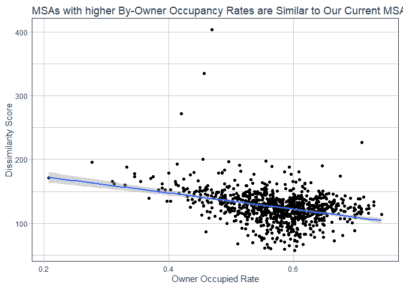

Look-Alike MSA Analysis
================

# Look-Alike Analysis for U.S. Markets

Sometimes known as “Whitespace” analysis, a typical geo-spatial question
we might want to answer is: what new markets “look like” my current
markets, or my high-performing markets?

In this example, we simulate a business with high-performing operations
in 7 U.S. citites, and then score all U.S. MSAs (metropolitan
statistical area / micropolitan statistical area) in terms of how
“similar”/“dissimilar” they are according to a handful of common
variables from the U.S. census (household income, median age, etc.).

# 0.0 LIBRARIES

``` r
# WORKING WITH DATA: 
library(tidyverse) # data manipulation
library(sf) # work with spatial data
library(doFuture) # parallelization 

# SOURCING DATA: 
library(tidygeocoder) # geocode addresses using OSM and census APIs
library(tidycensus) # source census ACS data
library(tigris); options(tigris_use_cache = TRUE) # for sourcing geographical shapefiles

# PLOTTING AND MAPPING:
library(maps) # for plotting maps
library(ggrepel) # for plotting labels on maps
suppressPackageStartupMessages(library(tidyquant)) # I like the color palettes in this package
```

# 1.0 DEFINE CURRENT MARKETS

In this exercise, we’re going to imagine we are analyzing a business
with operations in 7 US towns/cities.  
Below, we are writing our the names of the cities, then geo-coding them
with lat-lon coordinates.

``` r
# Define Markets:

sample_cities <- 
  tribble(~City,    ~State
          , "Pittsburg",    "PA"
          , "Richmond", "VA"
          , "Charleston",   "SC"
          , "Raleigh",  "NC"
          , "Charlotte",    "NC"
          , "Atlanta",  "GA"
          , "Dallas",   "TX"
          , "Seattle", "WA"
          )

sample_cities
```

    ## # A tibble: 8 x 2
    ##   City       State
    ##   <chr>      <chr>
    ## 1 Pittsburg  PA   
    ## 2 Richmond   VA   
    ## 3 Charleston SC   
    ## 4 Raleigh    NC   
    ## 5 Charlotte  NC   
    ## 6 Atlanta    GA   
    ## 7 Dallas     TX   
    ## 8 Seattle    WA

Geo-code the cities then plot on a map.

``` r
# cache the geo-coded cities so you only have to run this once: 

if(!file.exists("lat_longs.csv")){

  lat_longs <- 
    sample_cities %>%
    mutate(addr=paste0(City, ", ",State)) %>% 
    tidygeocoder::geocode(addr, method = 'cascade', lat = latitude , long = longitude)
  
  write_csv(lat_longs,"lat_longs.csv")
  
} else {
  
  lat_longs <- read_csv("lat_longs.csv", col_types = cols())
  
}


ggplot(lat_longs, aes(longitude, latitude), color="grey99") +
  geom_point()+
  borders("state") + geom_point() + 
  geom_label_repel(aes(label = addr)) + 
  theme_void()
```

<!-- -->

Next, intersect our geo-coded cities with MSA shapefiles, sourced using
the `tigris`
package.

``` r
lat_longs_sf <- lat_longs %>% st_as_sf(coords = c("longitude","latitude"), crs = 4326)

msa_sf <- 
  tigris::core_based_statistical_areas(class = "sf") %>% 
  select(GEOID, "MSA_NAME" = NAME, geometry) %>% 
  st_transform(4326)

# joining using st_intersection from the sf package

Cities_Joined_to_MSA <- 
  st_intersection(lat_longs_sf, msa_sf) %>% 
  st_set_geometry(NULL) %>% 
  left_join(msa_sf, by = c("GEOID", "MSA_NAME")) %>% 
  st_as_sf()

Cities_Joined_to_MSA %>% 
  ggplot() +
  borders("state") + 
  geom_sf(fill = palette_light()[2])+
  geom_point(data = lat_longs, aes(x = longitude, y = latitude))+
  geom_label_repel(data = lat_longs, aes(x = longitude, y = latitude, label = addr)
                   , force = 10) + 
  theme_void()
```

<!-- -->

# 2.0 SOURCE CENSUS DATA

Chosen (somewhat) arbitrarily, here are the variables we’re after:

  - Population (& Population Density (/sq miles))

  - # Population 65+ (& % of Population 65+)

  - Median Household Income

  - Median Age

  - Owner-Occupied Housing Unit Rate

  - Median Home Value

  - Unemployment Rate

## 2.1 Exploring Census Variables

Using the `tidycensus` package, we can source these variables IF we know
the census code for each. Luckily, `tidycensus` comes with a dictionary
of ACS variable names and codes. I *highly* recommend copying the
dictionary to your clipboard and pasting into Excel.

``` r
v18 <- load_variables(2018, "acs5", cache = TRUE)

## 1. inspect using the Viewer:
# v18 %>% View()

## 2. copy to clipboard and paste into Excel: 
# v18 %>% clipr::write_clip()

v18
```

    ## # A tibble: 26,996 x 3
    ##    name       label                           concept                           
    ##    <chr>      <chr>                           <chr>                             
    ##  1 B00001_001 Estimate!!Total                 UNWEIGHTED SAMPLE COUNT OF THE PO~
    ##  2 B00002_001 Estimate!!Total                 UNWEIGHTED SAMPLE HOUSING UNITS   
    ##  3 B01001_001 Estimate!!Total                 SEX BY AGE                        
    ##  4 B01001_002 Estimate!!Total!!Male           SEX BY AGE                        
    ##  5 B01001_003 Estimate!!Total!!Male!!Under 5~ SEX BY AGE                        
    ##  6 B01001_004 Estimate!!Total!!Male!!5 to 9 ~ SEX BY AGE                        
    ##  7 B01001_005 Estimate!!Total!!Male!!10 to 1~ SEX BY AGE                        
    ##  8 B01001_006 Estimate!!Total!!Male!!15 to 1~ SEX BY AGE                        
    ##  9 B01001_007 Estimate!!Total!!Male!!18 and ~ SEX BY AGE                        
    ## 10 B01001_008 Estimate!!Total!!Male!!20 years SEX BY AGE                        
    ## # ... with 26,986 more rows

Once you’ve located your variables, store them in a named-list. To save
space I’ve stored my desired variable codes in a separate script
`99-Store ACS Var Names.R` so I can source is below. You can source all
variable at once but for convinience of working with the data I’ve
created three “sets”: Age, Unemployment and Other.

``` r
acs_var_list <- source("99-Store ACS Var Names.r")[["value"]]

names(acs_var_list)
```

    ## [1] "Age Variables"          "Other ACS Variables"    "Unemployment Variables"

Here’s an example of what the “Age” variables look
    like:

``` r
head(acs_var_list$`Age Variables`, 10)
```

    ##        Total_Population   Total_Population_Male Total_Population_Female 
    ##            "B01001_001"            "B01001_002"            "B01001_026" 
    ##            Male_Under_5                Male_5_9              Male_10_14 
    ##            "B01001_003"            "B01001_004"            "B01001_005" 
    ##              Male_15_17              Male_18_19                 Male_20 
    ##            "B01001_006"            "B01001_007"            "B01001_008" 
    ##                 Male_21 
    ##            "B01001_009"

## 2.2 Calling the Census API

### Age:

``` r
(
  msa_age <- 
    get_acs(geography = "metropolitan statistical area/micropolitan statistical area"
            , year = 2018
            , survey = "acs5"
            , variables = acs_var_list$`Age Variables` 
            , geometry = F
            , cache = T
    ) %>% 
    select(GEOID, variable, estimate) %>% 
    spread(variable, estimate) %>% 
    select(GEOID, one_of(names(acs_var_list$`Age Variables`))) %>% 
    mutate(Age_65_up = rowSums(select(., Male_65_66:Male_85_up, Female_65_66:Female_85_up))
           , Percent_Over_65 = Age_65_up/Total_Population)
)
```

    ## # A tibble: 945 x 52
    ##    GEOID Total_Population Total_Populatio~ Total_Populatio~ Male_Under_5
    ##    <chr>            <dbl>            <dbl>            <dbl>        <dbl>
    ##  1 10100            42780            21068            21712         1428
    ##  2 10140            71967            36981            34986         2025
    ##  3 10180           170009            85988            84021         6012
    ##  4 10220            38358            18768            19590         1378
    ##  5 10260            18181             8862             9319          443
    ##  6 10300            98474            49815            48659         2689
    ##  7 10380           307555           149692           157863         7034
    ##  8 10420           704454           342599           361855        19517
    ##  9 10460            65745            33886            31859         2221
    ## 10 10500           153101            72607            80494         5057
    ## # ... with 935 more rows, and 47 more variables: Male_5_9 <dbl>,
    ## #   Male_10_14 <dbl>, Male_15_17 <dbl>, Male_18_19 <dbl>, Male_20 <dbl>,
    ## #   Male_21 <dbl>, Male_22_24 <dbl>, Male_25_29 <dbl>, Male_30_34 <dbl>,
    ## #   Male_35_39 <dbl>, Male_40_44 <dbl>, Male_45_49 <dbl>, Male_50_54 <dbl>,
    ## #   Male_55_59 <dbl>, Male_60_61 <dbl>, Male_62_64 <dbl>, Male_65_66 <dbl>,
    ## #   Male_67_69 <dbl>, Male_70_74 <dbl>, Male_75_79 <dbl>, Male_80_84 <dbl>,
    ## #   Male_85_up <dbl>, Female_Under_5 <dbl>, Female_5_9 <dbl>,
    ## #   Female_10_14 <dbl>, Female_15_17 <dbl>, Female_18_19 <dbl>,
    ## #   Female_20 <dbl>, Female_21 <dbl>, Female_22_24 <dbl>, Female_25_29 <dbl>,
    ## #   Female_30_34 <dbl>, Female_35_39 <dbl>, Female_40_44 <dbl>,
    ## #   Female_45_49 <dbl>, Female_50_54 <dbl>, Female_55_59 <dbl>,
    ## #   Female_60_61 <dbl>, Female_62_64 <dbl>, Female_65_66 <dbl>,
    ## #   Female_67_69 <dbl>, Female_70_74 <dbl>, Female_75_79 <dbl>,
    ## #   Female_80_84 <dbl>, Female_85_up <dbl>, Age_65_up <dbl>,
    ## #   Percent_Over_65 <dbl>

### Unemployment:

``` r
(
  msa_employment <- 
    get_acs(geography = "metropolitan statistical area/micropolitan statistical area"
            , year = 2018
            , survey = "acs5"
            , variables = acs_var_list$`Unemployment Variables`
            , geometry = F
            , cache = T
    ) %>% 
    select(GEOID, variable, estimate) %>% 
    spread(variable, estimate) %>% 
    select(GEOID, one_of(names(acs_var_list$`Unemployment Variables`))) %>% 
    mutate(Total_Unemployed = rowSums(select(.,contains("Unemployed")), na.rm = T)
           , Labor_Force = rowSums(select(., contains("labor_force")), na.rm = T)
           , Unemployment_Rate = Total_Unemployed/Labor_Force)
)
```

    ## # A tibble: 945 x 12
    ##    GEOID Male_16_64_labo~ Males_65_up_lab~ Female_16_64_la~ Female_65_up_la~
    ##    <chr>            <dbl>            <dbl>            <dbl>            <dbl>
    ##  1 10100            10281              888             9335              845
    ##  2 10140            13088              928            11456             1091
    ##  3 10180            30880             2439            28476             1946
    ##  4 10220             6282              605             5670              383
    ##  5 10260             2367               93             2036               29
    ##  6 10300            22010             1196            19844             1252
    ##  7 10380            39571             1293            31974              542
    ##  8 10420           153828            10491           139298             8088
    ##  9 10460            11808              705             9388              547
    ## 10 10500            15274             1516            13572             1190
    ## # ... with 935 more rows, and 7 more variables: Male_16_64_Unemployed <dbl>,
    ## #   Male_65_up_Unemployed <dbl>, Female_16_64_Unemployed <dbl>,
    ## #   Female_65_up_Unemployed <dbl>, Total_Unemployed <dbl>, Labor_Force <dbl>,
    ## #   Unemployment_Rate <dbl>

### Other:

``` r
(
  msa_other <- 
    get_acs(geography = "metropolitan statistical area/micropolitan statistical area"
            , year = 2018
            , survey = "acs5"
            , variables = acs_var_list$`Other ACS Variables`
            , geometry = F
            , cache = T
    ) %>% 
    select(GEOID, variable, estimate) %>% 
    spread(variable, estimate) %>% 
    select(GEOID, one_of(names(acs_var_list$`Other ACS Variables`))) %>% 
    mutate(Owner_Occupied_Rate = Owner_Occupied_units / Housing_units)
)
```

    ## # A tibble: 945 x 10
    ##    GEOID Total_Population Median_Househol~ Median_Home_Val~ Median_age
    ##    <chr>            <dbl>            <dbl>            <dbl>      <dbl>
    ##  1 10100            42780            57184           155200       37.3
    ##  2 10140            71967            47770           168500       43.7
    ##  3 10180           170009            49945           110100       33.9
    ##  4 10220            38358            49235           125700       35.6
    ##  5 10260            18181            12902            85200       40.9
    ##  6 10300            98474            53972           133300       41.7
    ##  7 10380           307555            16369            98600       42  
    ##  8 10420           704454            55718           144900       40.2
    ##  9 10460            65745            42752           108300       35.6
    ## 10 10500           153101            42861           114700       36.7
    ## # ... with 935 more rows, and 5 more variables: Housing_units <dbl>,
    ## #   Owner_Occupied_units <dbl>, Renter_Occupied_units <dbl>,
    ## #   Vacant_units <dbl>, Owner_Occupied_Rate <dbl>

## 2.3 Combine Census Data

``` r
MSA_WITH_TARGET_MAKRETS <- 
  
  # Age census data: 
  select(msa_age, GEOID, Percent_Over_65) %>% 
  
  # Unemployment census data: 
  left_join(
    select(msa_employment, GEOID, Unemployment_Rate)
    , by = "GEOID") %>% 
  
  # Other census data: 
  left_join(
    select(msa_other, GEOID, Total_Population:Median_age, Housing_units, Owner_Occupied_Rate)
    , by = "GEOID") %>% 
  
  # MSA shapefile data (for mapping)
  left_join(msa_sf
            , by = "GEOID") %>% 
  
  # Convert to spatial sf object and calculate land area
  st_as_sf() %>% 
  mutate(Area = st_area(geometry)
         , Area = units::set_units(Area, mi^2)
         ) %>% 
  
  # Calculate density variables (e.g. pop/sq mile)
  mutate(Pop_Per_Sq_Mile = as.numeric(Total_Population/Area)
         , Housing_Units_Per_Sq_Mile = as.numeric(Housing_units / Area)) %>% 
  
  # convert back to dataframe
  st_set_geometry(NULL) %>% 
  
  # remove vestigal variables
  select(-Area, -MSA_NAME) %>%
  
  # Identify our current markets with the variable TARGET_MARKET
  mutate(TARGET_MARKET = ifelse(GEOID %in% Cities_Joined_to_MSA$GEOID, 1, 0))


# did we successfully map all of our target markets to the full dataset?
count(MSA_WITH_TARGET_MAKRETS, TARGET_MARKET)
```

    ## # A tibble: 2 x 2
    ##   TARGET_MARKET     n
    ##           <dbl> <int>
    ## 1             0   937
    ## 2             1     8

``` r
glimpse(MSA_WITH_TARGET_MAKRETS)
```

    ## Rows: 945
    ## Columns: 12
    ## $ GEOID                     <chr> "10100", "10140", "10180", "10220", "1026...
    ## $ Percent_Over_65           <dbl> 0.1689107, 0.2029680, 0.1463099, 0.160279...
    ## $ Unemployment_Rate         <dbl> 0.02276453, 0.07901969, 0.04039786, 0.042...
    ## $ Total_Population          <dbl> 42780, 71967, 170009, 38358, 18181, 98474...
    ## $ Median_Household_Income   <dbl> 57184, 47770, 49945, 49235, 12902, 53972,...
    ## $ Median_Home_Value         <dbl> 155200, 168500, 110100, 125700, 85200, 13...
    ## $ Median_age                <dbl> 37.3, 43.7, 33.9, 35.6, 40.9, 41.7, 42.0,...
    ## $ Housing_units             <dbl> 19998, 36005, 71259, 16826, 7594, 43751, ...
    ## $ Owner_Occupied_Rate       <dbl> 0.5983098, 0.5197611, 0.5265300, 0.554083...
    ## $ Pop_Per_Sq_Mile           <dbl> 14.843772, 32.365003, 61.648709, 52.89164...
    ## $ Housing_Units_Per_Sq_Mile <dbl> 6.938891, 16.192170, 25.839958, 23.201285...
    ## $ TARGET_MARKET             <dbl> 0, 0, 0, 0, 0, 0, 0, 0, 0, 0, 0, 0, 0, 0,...

# 3.0 STANDARDIZE VARIABLES

We want to calculate a distance metric for new MSAs from our current
MSAs, but there is a high degree of variability between features in the
data. For example, `Total Population` can vary widely while `Percent of
People >65 Years Old` can only have values 0-1.

``` r
summary(MSA_WITH_TARGET_MAKRETS$Total_Population)
```

    ##     Min.  1st Qu.   Median     Mean  3rd Qu.     Max. 
    ##    12906    39473    74487   325852   180216 19990592

We need to *standardize* the features so that no one variable has too
much effect on the distance scoring. To do that, using `base::scale` we
will subtract the mean and divide by the standard deviation so that each
variable has a mean of 0 and an SD of 1.

``` r
MSA_WITH_TARGET_MAKRETS_STANDARDIZED <- 
  MSA_WITH_TARGET_MAKRETS %>% 
  mutate_at(vars(Percent_Over_65:Housing_Units_Per_Sq_Mile), function(x) as.numeric(scale(x, center = T, scale = T)))

summary(MSA_WITH_TARGET_MAKRETS_STANDARDIZED$Total_Population)
```

    ##    Min. 1st Qu.  Median    Mean 3rd Qu.    Max. 
    ## -0.2849 -0.2607 -0.2289  0.0000 -0.1326 17.9035

# 4.0 CALCULATE DISSIMILARITY

Our dissimilarity score (or similarity score, either works) is defined
as the total absolute difference between each variable in a new MSA and
all variables in all current MSAs. This is very similar to a `K-NN`
calculation. We could of course vary the dissimilairty scoring any
number of ways: changing the underlying markets we’re comparing to,
changing the weighting of the variables or including different variables
altogether.

Down the road, we might want to build this scoring into an app so that a
user could try different variable weights / compare to different
markets. Since that’s the case, we’ll take an extra step here to try and
speed up the distance calculation a bit through some parallelization
using the `doFuture`
package.

``` r
TARGET_MAKRETS <- MSA_WITH_TARGET_MAKRETS_STANDARDIZED %>% filter(TARGET_MARKET==1) %>% select(-TARGET_MARKET)
NON_TARGET_MAKRETS <- MSA_WITH_TARGET_MAKRETS_STANDARDIZED %>% filter(TARGET_MARKET==0) %>% select(-TARGET_MARKET)

# optimizing for the speed of our distance calculation later, 
# it's easiest to construct a dataframe where each row of the NON_TARGET_MARKET
# dataframe is replicated nrow(TARGET_MARKET) times
NON_TARGET_MAKRETS_rows_replicated <- 
  replicate(n = nrow(TARGET_MAKRETS)
            , expr = NON_TARGET_MAKRETS, simplify = F) %>% 
  bind_rows()

message(nrow(NON_TARGET_MAKRETS)," rows replicated to ",  nrow(NON_TARGET_MAKRETS_rows_replicated))
```

    ## 937 rows replicated to 7496

``` r
# NOTE: parallelization cuts the scoring time from ~30 seconds sequential to under 10
# this would be important if we built this into an app where you could weight and re-score MSAs

registerDoFuture()
# plan(sequential) # equivalent to registerDoSeq
plan(multiprocess, .skip = T)

tictoc::tic()
out <- foreach(i = 1:nrow(NON_TARGET_MAKRETS)
               , .verbose = F # set this to T if you'd like to monitor progress
               ) %dopar% {
  # i <- 1
  #message(i," of ", nrow(NON_WSH_MAKRETS))
  the_geoid <- NON_TARGET_MAKRETS[[i,"GEOID"]]
  row_frame <- NON_TARGET_MAKRETS_rows_replicated %>% filter(GEOID==the_geoid)
  
  export_out <- 
    c(GEOID = the_geoid, 
      colSums(abs(select_if(TARGET_MAKRETS, is.numeric) - 
                    select_if(row_frame, is.numeric)))
      )
  export_out
    
}

all_distances <-   
  out %>% 
  purrr::map({~.x %>% 
      enframe() %>% 
      spread(name, value)
  }) %>% 
  bind_rows() %>% 
  mutate_at(vars(-GEOID), as.numeric) %>% 
  mutate(Total_Dist = rowSums(select_if(., is.numeric))) %>% 
  left_join(msa_sf, by = "GEOID") %>% 
  mutate(State = str_sub(MSA_NAME,start = -2, end = -1))


plan(sequential) # turns off background workers
tictoc::toc()
```

    ## 16.73 sec elapsed

``` r
all_distances
```

    ## # A tibble: 937 x 15
    ##    GEOID Housing_units Housing_Units_P~ Median_age Median_Home_Val~
    ##    <chr>         <dbl>            <dbl>      <dbl>            <dbl>
    ##  1 10100          23.1            20.3        2.50             6.36
    ##  2 10140          22.8            19.3        9.97             5.49
    ##  3 10180          22.1            18.4        5.95            10.1 
    ##  4 10220          23.1            18.6        3.55             8.77
    ##  5 10260          23.3             9.79       6.31            12.3 
    ##  6 10300          22.6            15.2        7.29             8.11
    ##  7 10380          20.7             5.25       7.65            11.1 
    ##  8 10420          17.6            13.6        5.46             7.10
    ##  9 10460          22.9            20.5        3.55            10.3 
    ## 10 10500          22.2            17.5        2.50             9.73
    ## # ... with 927 more rows, and 10 more variables: Median_Household_Income <dbl>,
    ## #   Owner_Occupied_Rate <dbl>, Percent_Over_65 <dbl>, Pop_Per_Sq_Mile <dbl>,
    ## #   Total_Population <dbl>, Unemployment_Rate <dbl>, Total_Dist <dbl>,
    ## #   MSA_NAME <chr>, geometry <MULTIPOLYGON [°]>, State <chr>

# 5.0 PLOT DISSIMILARITY SCORES

Below is the output of our analysis. As we can see, there are outliers
in the dissimilarity scores, caused primarily by the New York and L.A.
metro areas.

``` r
all_distances %>% 
  filter(!State %in% c("AK","HI","PR")) %>% 
  st_as_sf() %>% 
  ggplot()+
  geom_sf(aes(fill = Total_Dist))+
  geom_sf(data = Cities_Joined_to_MSA, fill = palette_light()[6], color = "black", size = 1)+
  borders("state")+
  scale_fill_gradient(low = palette_light()[3] 
                       , high = palette_light()[2] 
                       )+
  theme_void()+
  labs(fill = "Distance Score\n(Lower = More Similar)"
       , title = "Similarity scores for new MSAs"
       , subtitle = "Blue = current MSAs")
```

<!-- -->

To adjust for outliers, rather than removing them, we bucket the
dissimilarity scores into deciles.

``` r
all_distances %>% 
  mutate(Distance_Bucket = ntile(Total_Dist, 10)) %>% 
  filter(!State %in% c("AK","HI","PR")) %>% 
  st_as_sf() %>% 
  ggplot()+
  geom_sf(aes(fill = Distance_Bucket))+
  geom_sf(data = Cities_Joined_to_MSA, fill = palette_light()[6], color = "black", size = 1)+
  borders("state")+
  scale_fill_gradient(low = palette_light()[3] 
                       , high = palette_light()[2] 
                       )+
  theme_void()+
  labs(fill = "Distance Score\n(Lower = More Similar)"
       , title = "Similarity scores for new MSAs"
       , subtitle = "Blue = current MSAs")
```

<!-- -->

# 6.0 DRIVERS OF SIMILARITY

Finally, we may want to understand which variables are contributing most
to our dissimilarity scores. To do that, we can use linear regression to
parse out the effects of the variables on the dissimilarity scores.

Recall that a higher coeficient below corresponds to more dissimilarity,
while a negative coeficient means more similarity. Below, we see that
higher population, unemployment, and older populations drive
dissimilarity, while onwer occupancy, housing density, and median
household income drive similarity.

``` r
distance_scores <- 
  all_distances %>% 
  select(GEOID, Total_Dist) %>% 
  mutate(Distance_Bucket = ntile(Total_Dist, 10))

options(scipen = 999)
MSA_WITH_TARGET_MAKRETS %>% 
  filter(TARGET_MARKET==0) %>% 
  left_join(distance_scores, by = 'GEOID') %>% 
  select(-Distance_Bucket, -GEOID, -TARGET_MARKET) %>% 
  lm(Total_Dist~., data = .) %>% 
  summary() %>% 
  print() %>% 
  broom::tidy() %>% 
  filter(p.value<0.05) %>% 
  arrange(estimate)
```

    ## 
    ## Call:
    ## lm(formula = Total_Dist ~ ., data = .)
    ## 
    ## Residuals:
    ##      Min       1Q   Median       3Q      Max 
    ## -110.982   -7.161    0.172    7.350  161.272 
    ## 
    ## Coefficients:
    ##                                Estimate    Std. Error t value
    ## (Intercept)                146.62835496    7.25412172  20.213
    ## Percent_Over_65            323.88352912   36.33704689   8.913
    ## Unemployment_Rate          315.57754627   28.62575482  11.024
    ## Total_Population             0.00008534    0.00001070   7.979
    ## Median_Household_Income     -0.00034840    0.00009708  -3.589
    ## Median_Home_Value            0.00002015    0.00001122   1.795
    ## Median_age                  -0.36445169    0.28884094  -1.262
    ## Housing_units               -0.00019100    0.00002684  -7.115
    ## Owner_Occupied_Rate       -102.47497085   10.55646433  -9.707
    ## Pop_Per_Sq_Mile              0.04450386    0.03795840   1.172
    ## Housing_Units_Per_Sq_Mile   -0.21625432    0.09055439  -2.388
    ##                                       Pr(>|t|)    
    ## (Intercept)               < 0.0000000000000002 ***
    ## Percent_Over_65           < 0.0000000000000002 ***
    ## Unemployment_Rate         < 0.0000000000000002 ***
    ## Total_Population           0.00000000000000434 ***
    ## Median_Household_Income               0.000349 ***
    ## Median_Home_Value                     0.072918 .  
    ## Median_age                            0.207349    
    ## Housing_units              0.00000000000223592 ***
    ## Owner_Occupied_Rate       < 0.0000000000000002 ***
    ## Pop_Per_Sq_Mile                       0.241323    
    ## Housing_Units_Per_Sq_Mile             0.017135 *  
    ## ---
    ## Signif. codes:  0 '***' 0.001 '**' 0.01 '*' 0.05 '.' 0.1 ' ' 1
    ## 
    ## Residual standard error: 16.63 on 925 degrees of freedom
    ##   (1 observation deleted due to missingness)
    ## Multiple R-squared:  0.5831, Adjusted R-squared:  0.5786 
    ## F-statistic: 129.4 on 10 and 925 DF,  p-value: < 0.00000000000000022

    ## # A tibble: 8 x 5
    ##   term                          estimate  std.error statistic  p.value
    ##   <chr>                            <dbl>      <dbl>     <dbl>    <dbl>
    ## 1 Owner_Occupied_Rate       -102.        10.6           -9.71 2.79e-21
    ## 2 Housing_Units_Per_Sq_Mile   -0.216      0.0906        -2.39 1.71e- 2
    ## 3 Median_Household_Income     -0.000348   0.0000971     -3.59 3.49e- 4
    ## 4 Housing_units               -0.000191   0.0000268     -7.12 2.24e-12
    ## 5 Total_Population             0.0000853  0.0000107      7.98 4.34e-15
    ## 6 (Intercept)                147.         7.25          20.2  1.57e-75
    ## 7 Unemployment_Rate          316.        28.6           11.0  1.22e-26
    ## 8 Percent_Over_65            324.        36.3            8.91 2.59e-18

Owner occupied rate has one of the largest coeficients and strongest
linear relationships. Plotting that below:

``` r
MSA_WITH_TARGET_MAKRETS %>% 
  filter(TARGET_MARKET==0) %>% 
  left_join(distance_scores, by = 'GEOID') %>% 
  select(-Distance_Bucket, -GEOID, -TARGET_MARKET) %>% 
  ggplot()+
  aes(Owner_Occupied_Rate, Total_Dist)+
  geom_point()+
  geom_smooth(method = "lm")+
  theme_tq()+
  labs(x = "Owner Occupied Rate"
       , y = "Dissimilarity Score"
       , title = "MSAs with higher By-Owner Occupancy Rates are Similar to Our Current MSAs")
```

<!-- -->
